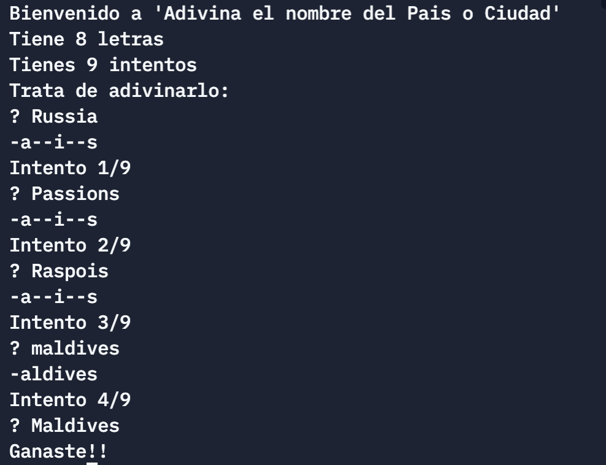

## Haskell with Cabal

This program runs the classic Hangman game, implemented in Haskell. 

## Setup & Run

- Open the shell (control/cmd + K) 
- Run `cabal update`
- Run `cabal new-install --lib --package-env . random`
- Run `ghci` and load the `Main.hs` file (`:l Main.hs`)
- Run `hangman`
- Have fun
## Usage

The program randomly assigns a country to guess from a list located in "places.txt", and you have length(country) - 1 tries to guess it.

